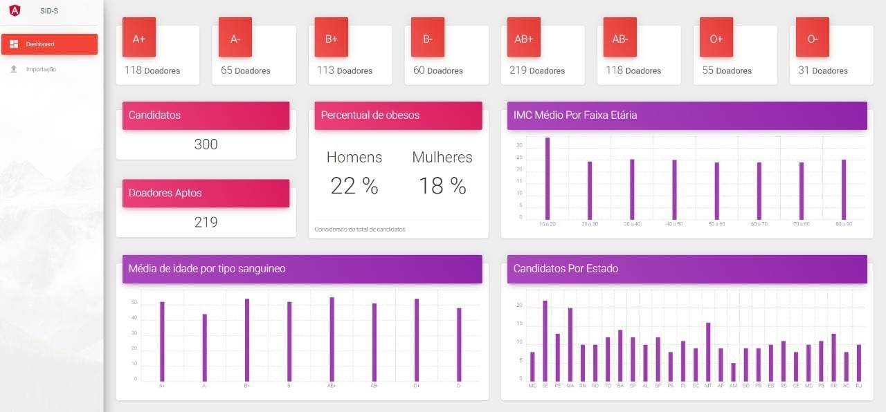
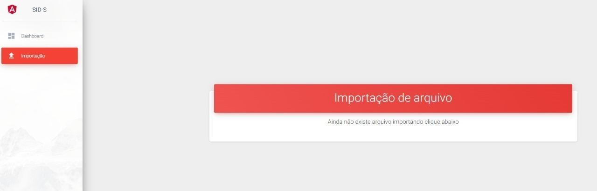

#Instruções de startup

##Requisitos
    * É necessário executar os scripts na pasta sqls, 
    antes de inicar o projeto

    * Os script devem ser executados na ordem 01,02,03

##Dicionário
    Tipo sanguineo: é a classificação dada a um tipo de
    sangue, baseado em suas características

    tiposSanguineosDoadores: Tipo/s de sangue que estão 
    aptos a doar para o sangue analizado

    tiposSanguineosRecebedor: Tipo/s de sangue que estão 
    habilitados a receber sangue analizado
 

##Informações
### GitHub
    https://github.com/rodrigues87/sids

### Projeto
    sids: projeto spring boot back
    sids-front: projeto front angular

## Postman Workspace
    https://www.getpostman.com/collections/89c532014341039db306

## Banco configurado no projeto
    MSQL
    database: sids-db
    username: sa
    password: Mp10fi#!

## ScreenShots

